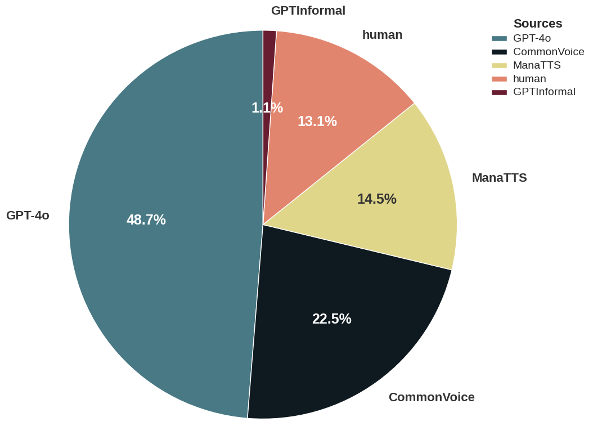
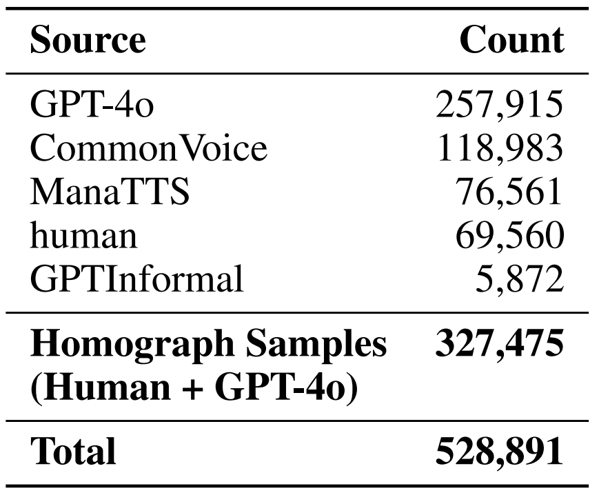
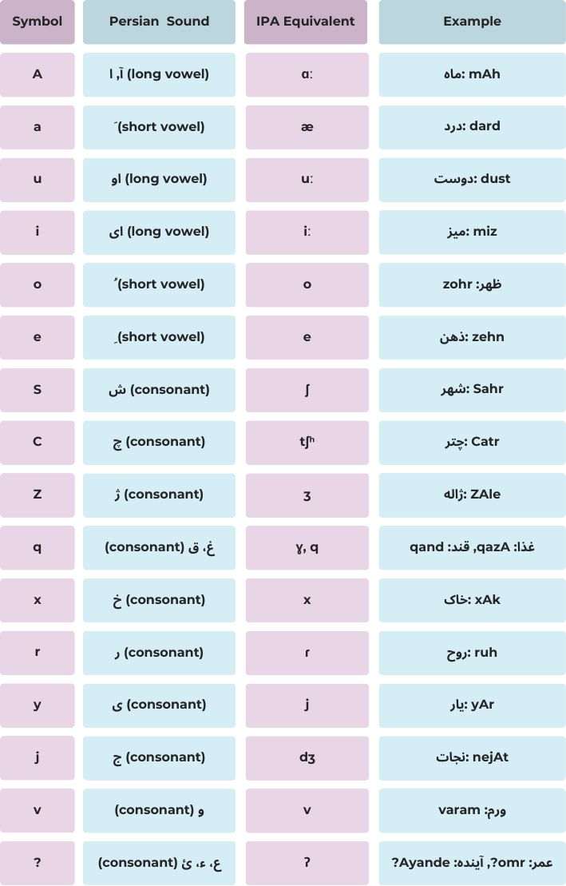

# HomoRich: A Persian Homograph Dataset for G2P Conversion  

HomoRich is the first large-scale, sentence-level Persian homograph dataset designed for grapheme-to-phoneme (G2P) conversion tasks. It addresses the scarcity of balanced, contextually annotated homograph data for low-resource languages. The dataset was created using a semi-automated pipeline combining human expertise and LLM-generated samples, as described in the paper:  
*[Fast, Not Fancy: Rethinking G2P with Rich Data and Rule-Based Models](https://arxiv.org/abs/2505.12973)*.  

## Overview 
The dataset contains 528,891 annotated Persian sentences (327,475 homograph-focused) covering 285 homograph words with 2-4 pronunciation variants each. Variants are equally represented (~500 samples each) to mitigate bias. The composition blends multiple sources for diversity, as shown below:

<div align="center">
  
<table style="border: none; border-collapse: collapse; margin: 0 auto;">
  <tr style="border: none;">
    <td style="border: none; padding: 0 10px; text-align: center;">
      
      <p style="margin-top: 5px;">Distribution of data sources in HomoRich dataset</p>
    </td>
    <td style="border: none; padding: 0 10px; text-align: center;">
      
      <p style="margin-top: 5px;">The source for different parts of the HomoRich dataset</p>
    </td>
  </tr>
</table>

</div>


### Phoneme Representations:
Persian G2P systems use two common phoneme formats:

- Repr. 1: Used in [KaamelDict](https://huggingface.co/datasets/MahtaFetrat/KaamelDict) and [SentenceBench](https://huggingface.co/datasets/MahtaFetrat/SentenceBench) (compatible with prior studies)
- Repr. 2: Adopted by [GE2PE](https://github.com/Sharif-SLPL/GE2PE) (state-of-the-art model enhanced in this work)

The HomoRich dataset includes both formats for broad compatibility. Below is a visual comparison:

<div align="center">

<table style="border: none; border-collapse: collapse; margin: 0 auto; width: auto;">
  <tr style="border: none;">
    <td style="border: none; padding: 0 10px; text-align: center;">
      
      <p style="margin-top: 5px;">Repr. 1</p>
    </td>
    <td style="border: none; padding: 0 10px; text-align: center;">
      
      <p style="margin-top: 5px;">Repr. 2</p>
    </td>
  </tr>
</table>

</div>


---

## Usage  
[](https://huggingface.co/datasets/MahtaFetrat/HomoRich-G2P-Persian)

Load the dataset directly from Hugging Face:

```python
import pandas as pd
from datasets import Dataset

file_urls = [
    "https://huggingface.co/datasets/MahtaFetrat/HomoRich-G2P-Persian/resolve/main/data/part_01.parquet",
    "https://huggingface.co/datasets/MahtaFetrat/HomoRich-G2P-Persian/resolve/main/data/part_02.parquet",
    "https://huggingface.co/datasets/MahtaFetrat/HomoRich-G2P-Persian/resolve/main/data/part_03.parquet"
]

# Combine into one dataset
df = pd.concat([pd.read_parquet(url) for url in file_urls], ignore_index=True)
dataset = Dataset.from_pandas(df)

print(f"Loaded {len(dataset)} examples")
```

### Data Example
```python
{
    'Grapheme': 'روی دیوار ننویسید.',
    'Phoneme': 'ruye divAr nanevisid',
    'Homograph Grapheme': 'رو',
    'Homograph Phoneme': 'ru',
    'Source': 'human', 
    'Source ID': 0,
    'Mapped Phoneme': 'ruye1 divar n/nevisid',
    'Mapped Homograph Phoneme': 'ru'
}
```
---

## Benchmarks  
The dataset was used to improve:  
1. **Homo-GE2PE** (Neural T5-based model): **76.89% homograph accuracy** (29.72% improvement).  
2. **HomoFast eSpeak** (Rule-based): **74.53% accuracy** with real-time performance (30.66% improvement).  

See [paper Table 3](#) for full metrics.  

---

### Dataset Creation and Processing

The `scripts` folder contains two key notebooks used in the dataset creation and processing pipeline:

1. `Generate\_Homograph\_Sentences.ipynb`: This notebook implements the prompt templates used to generate homograph-focused sentences as described in the paper, *[Fast, Not Fancy: Rethinking G2P with Rich Data and Rule-Based Models.](https://arxiv.org/abs/2505.12973)*

2. `Phonemize\_Sentences.ipynb`: This notebook applies the phonemization process based on the LLM-powered G2P method detailed in the *[LLM-Powered Grapheme-to-Phoneme Conversion: Benchmark and Case Study](https://ieeexplore.ieee.org/abstract/document/10888370)* paper.

---

## License  
- **Dataset**: Released under **CC0-1.0** (public domain).  
- **Code/Models**: **MIT License** (where applicable).  

---

## Citation  
```bibtex  
@misc{qharabagh2025fastfancyrethinkingg2p,
      title={Fast, Not Fancy: Rethinking G2P with Rich Data and Rule-Based Models}, 
      author={Mahta Fetrat Qharabagh and Zahra Dehghanian and Hamid R. Rabiee},
      year={2025},
      eprint={2505.12973},
      archivePrefix={arXiv},
      primaryClass={cs.CL},
      url={https://arxiv.org/abs/2505.12973}, 
}
```

---

## Contributions

Contributions and pull requests are welcome. Please open an issue to discuss the changes you intend to make.

---

### Additional Links  
- [Link to Paper](https://arxiv.org/abs/2505.12973)
- [HomoRich Dataset (Huggingface)](https://huggingface.co/datasets/MahtaFetrat/HomoRich-G2P-Persian)
- [HomoFast eSpeak NG](https://github.com/MahtaFetrat/HomoFast-eSpeak-Persian)
- [Homo-GE2PE Model (Github)](https://github.com/MahtaFetrat/Homo-GE2PE-Persian/)
- [Homo-GE2PE (Huggingface)](https://huggingface.co/MahtaFetrat/Homo-GE2PE-Persian)

